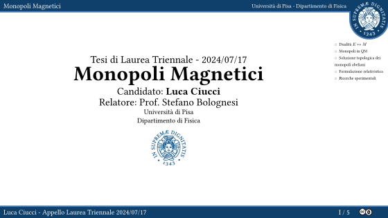

# tesi-triennale (Physics bachelor thesis)
 Slides for my bachelor thesis in Physics.

This repository contains the code for the slides of my bachelor thesis in Physics.

[](https://github.com/LucaCiucci/tesi-triennale/releases/tag/final)

## Compilation

```sh
typst compile main.typ main.pdf --input final=true
typst compile main.typ main-with-script.pdf
typst compile main.typ out-svg/{n}.svg --input final=true
```

Dev:
```sh
typst watch main.typ
start .\main.pdf
```